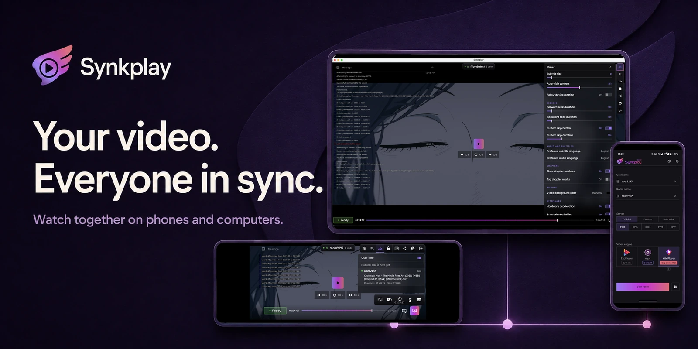
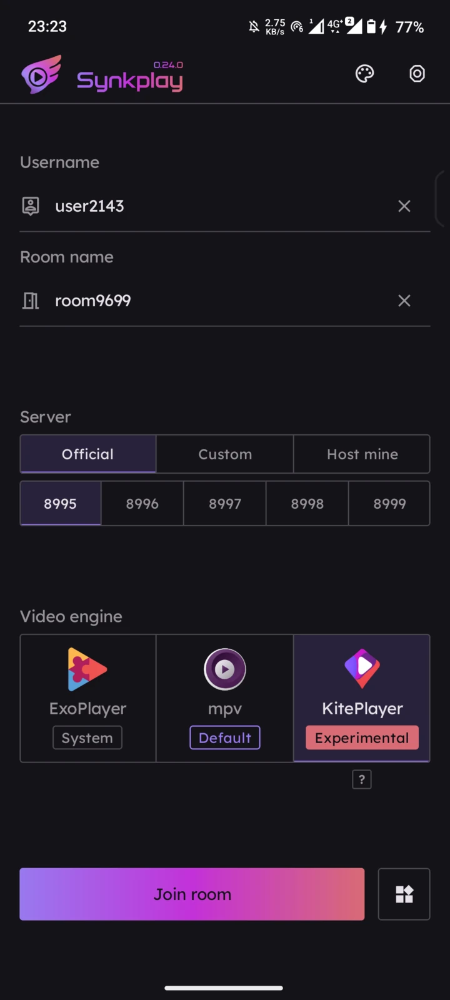
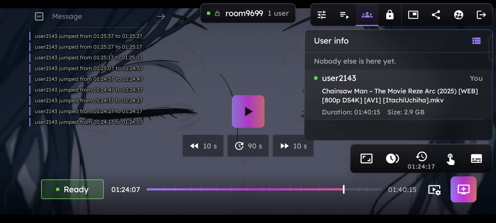
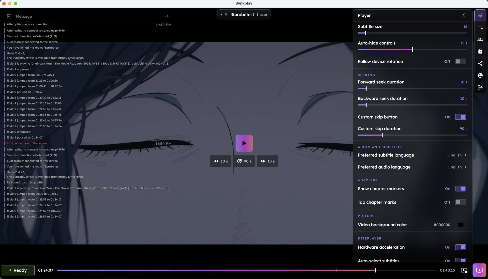

  

  <b>Android · iOS · Windows · macOS · Linux</b> 
  No sign-up. No ads. Open source.

  <a href="#download">Download</a> &nbsp;·&nbsp;
  <a href="#start-a-room">Start a room</a> &nbsp;·&nbsp;
  <a href="#screenshots">Screenshots</a> &nbsp;·&nbsp;
  <a href="#help">Help</a> &nbsp;·&nbsp;
  <a href="docs/DEVELOPING.md">Build</a>

Play, pause and seek together. Synkplay is an independent [Syncplay](https://syncplay.pl/) client,
compatible with the official desktop app.

> [!NOTE]
> Everyone opens the same video from their own file or link. Synkplay syncs playback; it does not send video or share your screen.

## Download

<!-- Rows have the same purpose on both platforms: store, direct file, other source. -->
<table align="center">
  <tr>
    <th align="center">Android</th>
    <th align="center">iPhone &amp; iPad</th>
  </tr>
  <tr>
    <td align="center">
       Store install
    </td>
    <td align="center">
       Store install
    </td>
  </tr>
  <tr>
    <td align="center">
       Full Android APK
    </td>
    <td align="center">
       IPA for sideloading
    </td>
  </tr>
  <tr>
    <td align="center">
       ExoPlayer only
    </td>
    <td align="center">
       Add to AltStore
    </td>
  </tr>
</table>

**Android:** 8.0+ · **Latest IPA:** iOS 14.1+ · Store versions may arrive later.

**On a computer?** [Run Synkplay from source](docs/DEVELOPING.md#desktop), or install [official Syncplay](https://syncplay.pl/download/) to join the same rooms.

<b>Which download should I choose?</b>

- **Android:** choose Google Play for a store install, or the latest full GitHub APK for mpv, ExoPlayer and KitePlayer. The universal APK covers all supported CPU types.
- **IzzyOnDroid:** a smaller, ExoPlayer-only app. It installs alongside the full app and has separate settings.
- **iPhone / iPad:** install from the App Store. For an IPA, [set up AltStore Classic](https://faq.altstore.io/), then use **Add to AltStore** above.

## Start a room

1. **Meet in the same room.** Use the same server, port and room name. The default public server is fine.
2. **Open your video.** Each person loads their file or video link.
3. **Mark yourself ready.** When everyone is ready, press play.

You can share an invite from inside the room. Friends need Synkplay installed to open its invite links.

**Watching alone?** Tap the logo on Home, then **Watch alone**. No server needed; your playback position is saved.

## What you can do

| Want to… | Use… |
|:---|:---|
| Pause or skip together | Shared playback controls |
| Talk during the video | Text, emoji and GIF chat |
| Queue the next episode | Shared playlists with auto-advance |
| Adjust for a different intro | Your own time offset |
| Use your subtitle files | External tracks on supported players |
| Host your own room | **Host mine** on Home |

<b>More controls, when you need them</b>

Themes, gesture controls, reduced motion, shared-playlist undo, and audio/subtitle language preferences.
Picture-in-Picture is available on Android and with AVPlayer or VLCKit on iOS.
Managed rooms let a controller decide playback. Filename and file-size sharing can be hidden or hashed.
Encrypted connections are available when the server supports them.

## Screenshots

  
  &nbsp;&nbsp;
  

Android home (portrait) · Android room (landscape)

  

macOS room · Select any screenshot to see it full size.

## Help

<b>Can my friends use Syncplay on PC?</b>

Yes. Join the same server, port and room, then open the same video. You can mix Synkplay and the official Syncplay desktop client.

<b>A video or subtitle will not play correctly.</b>

Leave the room and choose a different player on Home before joining again.
The defaults are **mpv** on full Android builds and **VLCKit** on iOS.
KitePlayer is experimental on mobile. AVPlayer cannot load external subtitle files.
[Compare the players](docs/DEVELOPING.md#player-capabilities).

<b>Why do I have two Android apps?</b>

The IzzyOnDroid app and the full GitHub / Google Play app use different app IDs, so they can coexist.
One does not update the other. Each keeps its own settings.

**Still stuck?** [Report a bug](https://github.com/yuroyami/syncplay-mobile/issues/new?template=bug_report.yml) · [Ask a question](https://github.com/yuroyami/syncplay-mobile/discussions) · [Request a feature](https://github.com/yuroyami/syncplay-mobile/issues/new?template=feature_request.yml)

## Make it better

Small fixes help. A clearer translation, a reproducible bug report, or a tested patch is welcome.

**[Translate on Weblate](https://hosted.weblate.org/engage/syncplay-mobile/)** &nbsp;·&nbsp;
**[Build & test](docs/DEVELOPING.md)** &nbsp;·&nbsp;
**[Support development](https://ko-fi.com/sidenaakram)**

<b>Thanks to the people behind it</b>

[Syncplay](https://syncplay.pl/) and [Et0h](https://github.com/Et0h) for the original project and help;
[soredake](https://github.com/soredake) for testing;
[Osanosa](https://github.com/Osanosa) for contributions;
[Zhaodaidai](https://github.com/Zhaodaidai), [DoncanC](https://github.com/DoncanC), [ivy-reps](https://github.com/ivy-reps), and everyone translating on Weblate.

---

  Built by <a href="https://github.com/yuroyami">yuroyami</a> with Kotlin &amp; Compose Multiplatform. 
  <a href="CHANGELOG.md">Release notes</a> &nbsp;·&nbsp;
  <a href="PRIVACY_POLICY.md">Privacy</a> &nbsp;·&nbsp;
  <a href="LICENSE">AGPL-3.0 license</a>

